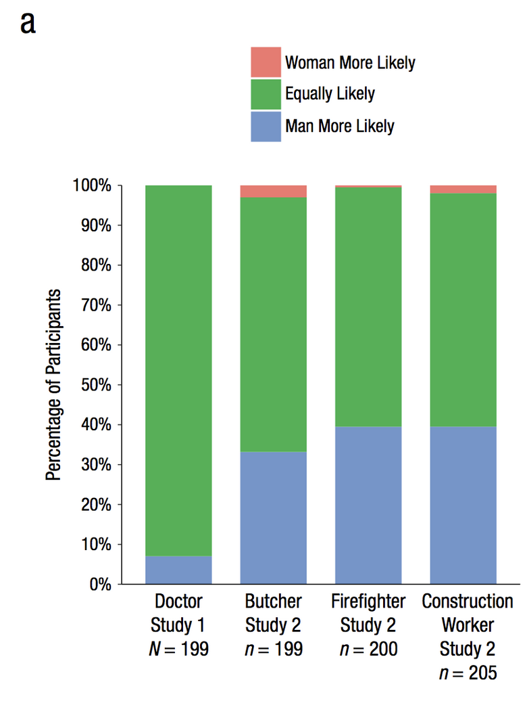
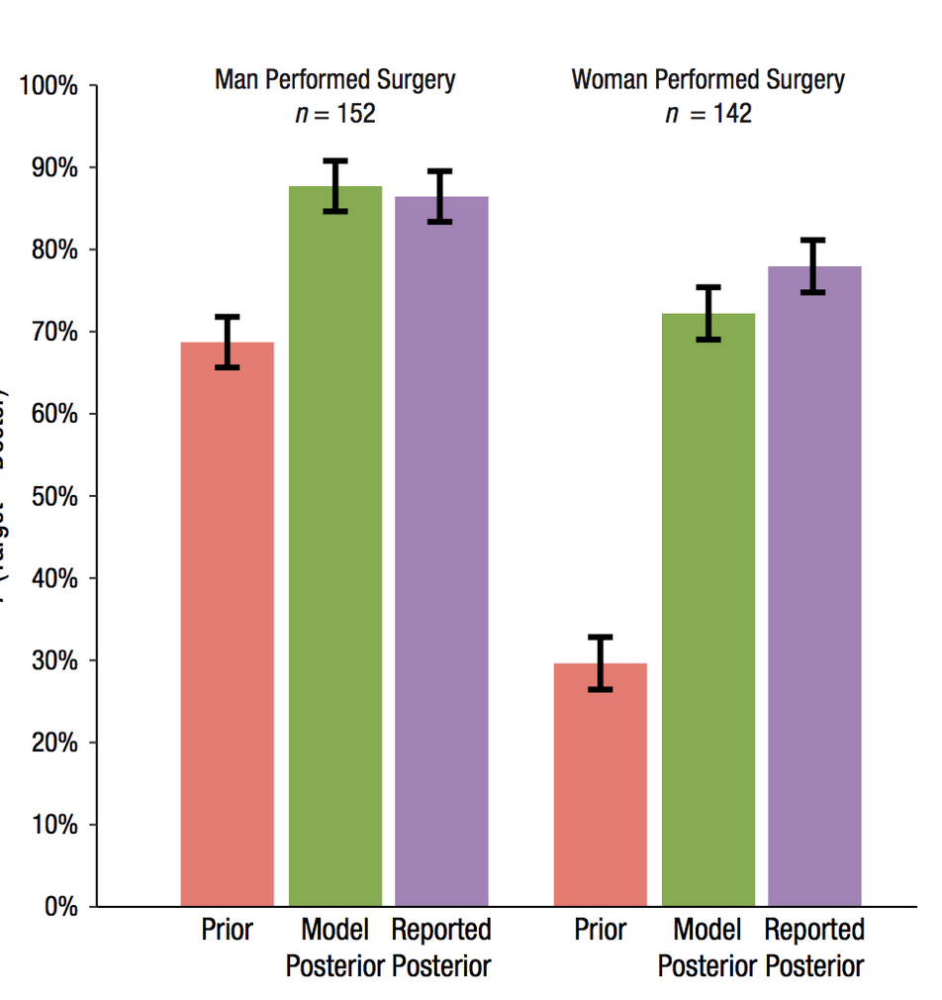

```{r setup, include=FALSE}
knitr::opts_chunk$set(echo = TRUE)
```


```{r, echo=FALSE, out.width="600px"}
knitr::include_graphics("datavis_figs/Calcutt1.png")
```

Figure 1
```{r eval_false}

Names <- rep(c("Dara", "Rita","Liza", "Katie", "Azalea","Barbi","Rowena","Fiona"),each=2)
MF <- c(60,59,55,51,37,46,3,3,47,23,46,1,40,5,11,0)
Condition <- rep(c("Social Condition", "Nonsocial Condition"),4)
Aversity <- rep(c("Aversive","Not Aversive"), each=8)
new_df <- data.frame(Names, Condition, Aversity, MF)
new_df

library(ggplot2)
ggplot(new_df, aes(x=Condition, y=MF, group=Names))+
  geom_line(aes(linetype=Aversity))+
  scale_linetype_manual(values=c("dashed","solid"))+
  geom_text(label=Names, y=(MF-c(1,100,4,100,-10,100,0,100,100,-26,100,-45,100,-36,100,-12)), x=rep(c(0.9,2.14),times=8))+
  theme_classic()+
  labs(x=" ",y="Mean Frequency of Risky Choice")

```

```{r, echo=FALSE, out.width="600px"}
knitr::include_graphics("datavis_figs/Calcutt2.png")
```

```{r}
nonsoc_risk <-c(0,1,3,5,25,45,55,59)
soc_risk <-c(12,47,4,41,48,34,56,60)
soc_df <- data.frame(nonsoc_risk,soc_risk)

library(ggplot2)
ggplot(soc_df, aes(x=nonsoc_risk, y=soc_risk))+
  geom_point()+
  geom_smooth(method=lm, se = FALSE, color="black")+
  theme_classic(base_size=12)+
  labs(x="Average Frequency of Nonsocial Risk", y="Average Frequency of Social Risk")

```

```{r, echo=FALSE, out.width="400px"}

```

```{r}
person <- rep(c("Doctor","Butcher","Firefighter","Construction Worker"),each=3)
person <- factor(person,levels=person[c(1,4,7,10)])
likelihood <- rep(c("Woman More Likely", "Equally Likely", "Man More Likely"),times=4)
likelihood <- factor(likelihood,levels=likelihood[c(1,5,9,13)])

#agree <- c(8,92,0,32,65,3,39,60,1,39,58,3)
agree <- c(0,92,8,3,65,32,1,60,39,3,58,39)
agr_df <- data.frame(person,likelihood,agree)

library(ggplot2)
ggplot(agr_df, aes(x=person, y=agree, group=likelihood, fill=likelihood))+
  geom_bar(stat="identity")+
  scale_fill_manual(values=c("#CC6666","998099","#457595"))+
  theme_classic(base_size=12)+
  labs(x=" ", y="Percentage of participants")
```

```{r, echo=FALSE, out.width="400px"}

```

```{r}
group1 <- rep(c("Prior","Model Posterior","Reported Posterior"),times=2)
group1 <- factor(group1, levels=group1[c(1,2,3)])
group2 <- rep(factor(c("Group 1","Group 2")),each=3)
scores <- c(69,87,86,29,71,75)
SE <- rep(4,6)
new_df <- data.frame(group1,group2,scores,SE)
new_df

library(ggplot2)
ggplot(new_df, aes(x=group2, y=scores, fill=group1))+
  geom_bar(stat="identity", position="dodge")+
  geom_errorbar(aes(ymin=scores-SE,
                    ymax=scores+SE),
                position=position_dodge(width=0.9),
                width=.2,
                color="black")+
  labs(x=" ",y="P(Target=Doctor")+
  theme_classic(base_size=12)

```


