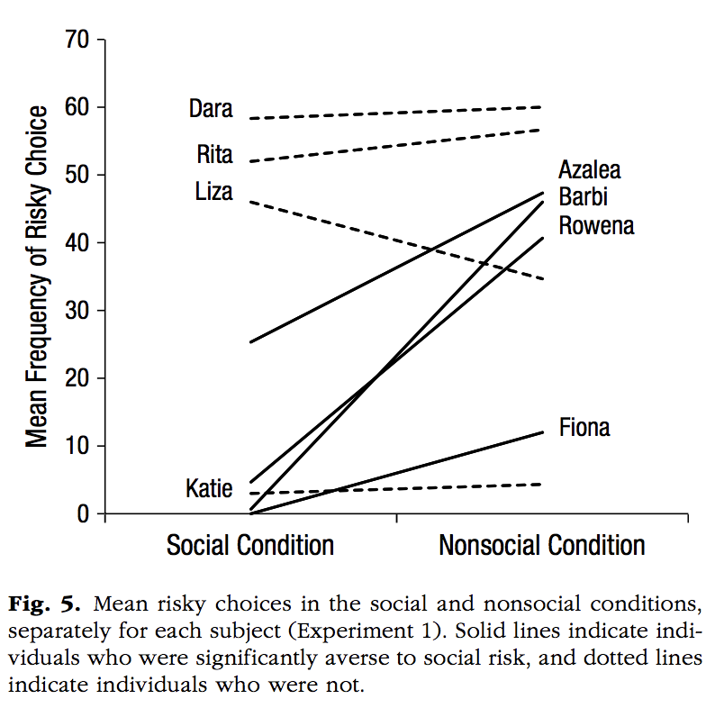
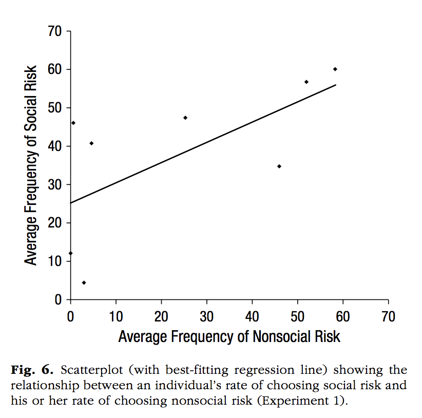

```{r setup, include=FALSE}
knitr::opts_chunk$set(echo = TRUE)
```


```{r, echo=FALSE, out.width="600px"}

```

Figure 1
```{r}
Names <- rep(c("Dara", "Rita","Liza", "Katie", "Azalea","Barbi","Rowena","Fiona"),each=2)
Names <- factor(Names,levels=Names[c(1,3,5,7,9,11,13,15)])
MF <- c(59,60,51,55,46,37,3,3,23,47,1,46,5,40,0,11)
Condition <- rep(c("Social Condition", "Nonsocial Condition"),4)
Condition <- factor(Condition, levels=Condition[c(1,2)])
Aversity <- rep(c("Aversive","Not Aversive"), each=8)
Aversity <- factor(Aversity, levels=Aversity[c(1,9)])
new_df <- data.frame(Names, Condition, Aversity, MF)

library(ggplot2)
ggplot(new_df, aes(x=Condition, y=MF, group=Names))+
  geom_line(aes(linetype=Aversity))+
  scale_y_continuous(breaks=c(0,10,20,30,40,50,60,70),
                     limits=c(0,70),
                     expand = c(0, 0))+
  scale_linetype_manual(values=c("dashed","solid"))+
  geom_text(label=Names, y=(c(59,100,51,100,46,100,3,100,100,49,100,46,100,40,100,11)),
            x=rep(c(0.9,2.14),times=8))+
  theme_classic()+
  labs(x=" ",y="Mean Frequency of Risky Choice")
```

```{r, echo=FALSE, out.width="600px"}

```

```{r}
nonsoc_risk <-c(0,1,3,5,25,45,55,59)
soc_risk <-c(12,47,4,41,48,34,56,60)
soc_df <- data.frame(nonsoc_risk,soc_risk)

library(ggplot2)
ggplot(soc_df, aes(x=nonsoc_risk, y=soc_risk))+
  geom_point()+
  geom_smooth(method=lm, se = FALSE, color="black")+
  scale_x_continuous(breaks=c(0,10,20,30,40,50,60,70),
                     limits=c(0,70),
                     expand = c(0, 0))+
  scale_y_continuous(breaks=c(0,10,20,30,40,50,60,70),
                     limits=c(0,70),
                     expand = c(0, 0))+
  theme_classic(base_size=12)+
  labs(x="Average Frequency of Nonsocial Risk", y="Average Frequency of Social Risk")+
  coord_fixed(ratio=1)
```


```{r}
person <- rep(c("Doctor","Butcher","Firefighter","Construction Worker"),each=3)
person <- factor(person,levels=person[c(1,4,7,10)])
Likelihood <- rep(c("Woman More Likely", "Equally Likely", "Man More Likely"),times=4)
Likelihood <- factor(Likelihood,levels=Likelihood[c(1,2,3)])

agree <- c(0,92,8,3,65,32,1,60,39,3,58,39)
agr_df <- data.frame(person,Likelihood,agree)

library(ggplot2)
library(grid)
library(gridExtra)
library(png)

my_graph <- ggplot(agr_df, aes(x=person, y=agree, group=Likelihood, fill=Likelihood))+
  geom_bar(stat="identity", width=0.75)+
  scale_fill_manual(values=c("#E37B71","#58AD58","#7595C7"))+
  scale_x_discrete(breaks=c("Doctor",
                            "Butcher",
                            "Firefighter",
                            "Construction Worker"),
                  labels=c("Doctor\nStudy 1\nN = 199",
                            "Butcher\nStudy 2\nn = 200",
                            "Firefighter\nStudy 2\nn = 200",
                            "Construction Worker\nStudy 2\nn = 205"))+
  scale_y_continuous(breaks=c(seq(0, 100, 10)),
                     labels=c("0%","10%","20%","30%","40%","50%","60%","70%","80%","90%","100%"),
                     limits=c(0,100),
                     expand = c(0, 0))+
  theme_classic(base_size=12)+
  theme(plot.margin = unit(c(3,0,0,0),"cm"),
        legend.position=c(0.5,1.25))+
  labs(x=" ", y="Percentage of participants")+
  coord_fixed(ratio=0.038)

lay <- rbind(c(1,1,2,2),
             c(1,1,2,2))
image <-  rasterGrob(as.raster(readPNG("datavis_figs/Cao1A.png")))
grid.arrange(image,my_graph,layout_matrix=lay)
```

```{r, eval=FALSE, echo=FALSE}
group1 <- rep(c("Prior","Model Posterior","Reported Posterior"),times=2)
group1 <- factor(group1, levels=group1[c(1,2,3)])
group2 <- rep(c("Group 1","Group 2"),each=3)
group2 <-factor(group2,levels=group2[c(1,4)])
scores <- c(69,87,86,29,71,75)
SE <- rep(4,6)
new_df <- data.frame(group1,group2,scores,SE)

library(ggplot2)
library(grid)
ggplot(new_df, aes(x=group2, y=scores, fill=group1))+
  geom_bar(stat="identity", position=position_dodge(width = 0.8), width = 0.7)+
  scale_fill_manual(values=c("#E37b71","#87AB52","#A082B5"))+
  scale_x_discrete(breaks=group2,
                   labels=rep(" ",6))+
  scale_y_continuous(breaks=c(seq(0, 100, 10)),
                     labels=c("0%","10%","20%","30%","40%","50%","60%","70%","80%","90%","100%"),
                     limits=c(0,100),
                     expand = c(0, 0))+
  geom_errorbar(aes(ymin=scores-SE,
                    ymax=scores+SE),
                position=position_dodge(width=0.8),
                width=.2,
                color="black")+
  labs(x=" ",y="P(Target=Doctor)")+
  theme_classic(base_size=12)
```

```{r}
group1 <- c(0.4,1.2,2,3.4,4.2,5)
scores <- c(69,87,86,29,71,75)
SE <- rep(4,6)
new_df <- data.frame(group1,scores,SE)

library(ggplot2)
library(grid)
library(gridExtra)
library(png)

my_graph <- ggplot(new_df, aes(x=group1, y=scores))+
  geom_bar(stat="identity", position=position_dodge(width = 0.8), width = 0.7,
           fill=c("#E37B71","#87AB52","#A082B5","#E37B71","#87AB52","#A082B5"))+
  scale_x_continuous(breaks=c(0.4,1.2,2,3.4,4.2,5),
                     labels=c(rep(c("Prior","Model\nPosterior","Reported\nPosterior"),times=2)),
                     limits=c(0,6))+
  scale_y_continuous(breaks=c(seq(0, 100, 10)),
                     labels=c("0%","10%","20%","30%","40%","50%","60%","70%","80%","90%","100%"),
                     limits=c(0,100),
                     expand = c(0, 0))+
  geom_errorbar(aes(ymin=scores-SE,
                    ymax=scores+SE),
                position=position_dodge(width=0.8),
                width=.2,
                color="black")+
  labs(x=" ",y="P(Target=Doctor)")+
  theme_classic(base_size=8)+
  theme(legend.title = element_blank())+
  annotation_custom(grobTree(textGrob("Men Performed Surgery\nn = 152", x=0.22,
                                      y=0.969, gp=gpar(fontsize=6))))+
  annotation_custom(grobTree(textGrob("Women Performed Surgery\nn = 152", x=.68,
                                      y=0.969, gp=gpar(fontsize=6))))+
  coord_fixed(ratio=0.07)

lay <- rbind(c(1,1,2,2),
             c(1,1,2,2))
image <-  rasterGrob(as.raster(readPNG("datavis_figs/ques_8.png")))
grid.arrange(image,my_graph,layout_matrix=lay)

```


```{r}
y <- c(rep(-2,1),rep(-1.5,1),rep(-1,2),rep(-0.5,2),rep(0,8),rep(0.5,14),rep(1,14),rep(1.5,13),
       rep(2,7),rep(2.5,6),rep(3,7),rep(3.5,5),rep(4,5),rep(4.5,1),rep(10,28))
x <- c(rep(0,114))
df <- data.frame(x,y)

library(ggplot2)
library(grid)
library(gridExtra)
library(png)

g1<- ggplot(df, aes(x=y))+
  geom_histogram(binwidth=0.5, color="black", fill="#53B7BD")+
  scale_x_continuous(breaks=c(),
                     labels=c(" "),
                     limits = c(-10,11), 
                     expand = c(0, 0))+
  scale_y_continuous(breaks=c(0,10,20,30,40),
                     labels=c("0%","10%","20%","30%","40%"),
                     limits=c(0,40),
                     expand = c(0, 0))+
  labs(x=" ", y="Participants (In Each Condition)")+
  ggtitle("Man Performed Surgery\nn = 152")+
  geom_vline(xintercept=0, linetype="dotted")+
  theme_classic(base_size = 10)+
  theme(plot.title = element_text(hjust = 0.5))+
  coord_fixed(ratio=0.4)

y <- c(rep(-2,1),rep(-1.5,4),rep(-1,6),rep(-0.5,4),rep(0,6),rep(0.5,5),rep(1,7),rep(1.5,8),rep(2,16),rep(2.5,9),rep(3,3),rep(3.5,4),rep(4,2),rep(10,40))
x <- rep(0,115)
df <- data.frame(x,y)

g2 <- ggplot(df, aes(x=y))+
  geom_histogram(binwidth=0.5, color="black", fill="#53B7BD")+
  scale_x_continuous(breaks=c(-10,-4,-2,0,2,4,10),
                     labels=c("- Inf","-4","-2","0","2","4","+ Inf"),
                     limits=c(-10,11),
                     expand = c(0, 0))+
  scale_y_continuous(breaks=c(0,10,20,30,40),
                     labels=c("0%","10%","20%","30%","40%"),
                     limits=c(0,40),
                     expand = c(0, 0))+
  labs(x="Log Liklihood Ratio", y="Participants (In Each Condition)")+
  ggtitle("Woman Performed Surgery\nn = 142")+
  geom_vline(xintercept=0, linetype="dotted")+
  theme_classic(base_size = 10)+
  theme(plot.title = element_text(hjust = 0.5))+
  coord_fixed(ratio=0.35)
  
image <-  rasterGrob(as.raster(readPNG("datavis_figs/ques_6_7.png")))
lay <- rbind(c(1,1,2,2),c(1,1,3,3))
grid.arrange(image,g1,g2, layout_matrix = lay)
```

