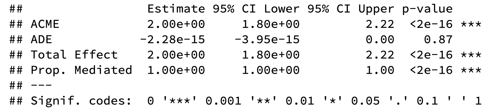
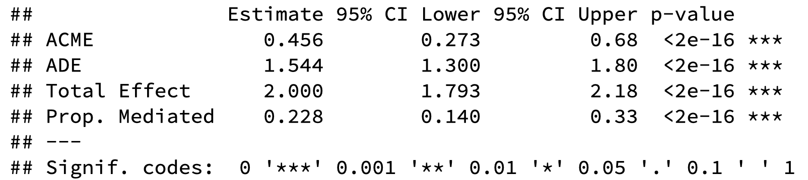

# Overview

## The aim of this tutorial is to:

- Review the concepts of mediation, moderation, and bootstrapping

- Demonstrate how to complete bootsrapped mediation analyses in R

- Generate hypothetical datasets to explore various possible mediation outcomes


---

## Explanatory Value of Analyses

- Simple statistical analyses like ANOVAs allow us to establish whether or not a relationship exists between two variables

- These analyses are limited, however, in that they *only* discern whether or not this relationship exists

- More complex statistical analyses such as **Mediation** and **Moderation** go beyond this, and allow us to test theoretically rich ideas

---

.pull-left[

## Mediation

- Mediation analyses help us examine the  * **mechanism**  * of the relationship between two variables

- Mediation answers the question of * **how** * variables are related

- A mediator variable * **explains the relationship** * between an independent variable and a dependent variable

]

.pull-right[

## Moderation

- Moderation analyses help us examine the * **conditions** * in which two variables are related

- Moderation answers the question of * **when** * variables are related

- A moderator variable * **affects the strength and/or direction** * of the relationship between an independent variable and a dependent variable

]

---

## Bootstrapping

- Bootstrapping is a statistical method that utilizes random resampling with replacement to estimate a population parameter

- This technique samples from a given dataset to estimate a parameter when it would otherwise be impossible or impractical to do so

- In this way, the dataset is treated as the population, and each random sample aims to replicate a potential score within the true population

- The amount of resamples varies, but usually falls between 1,000 and 10,000

- One advantage of the bootstrap method is that it produces confidence intervals for your statisitcal estimate

---

## Mediation: An Example

- Consider a case in which we know that mindfulness increases happiness in people

- Although there is clear evidence that mindfulness increases happiness, research has not yet explored why this is the case

- Suppose we think that mindfulness decreases stress, which in turn increases happiness

- In other words, we think that mindfulness only indirectly affects happiness *by means of* reducing stress.

---

## Mediation Effects

- X = independent variable

- Y = dependent variable

- M = mediator variable


---

## Mediation Effects

- The **total effect** is the total effect of X on Y, with no consideration of mediator variables

- This is also known as the **c path**


---

## Mediation Effects

- The **direct effect** is the effect of X on Y after removing the contribution of M

- This is known as the **c' path**


---

## Mediation Effects

- The effect of X on M is known as the **a path**

- The effect of M on Y is known as the **b path**

- The **indirect effect** is the effect of X on Y *through M*

  - This is equivalent to the product of the a path and the b path


---

## Mediation in R: *Mediation Package*

- This tutorial explains how to use the `mediate` function in the `mediation` package, and how to interpret the resulting statistics

- The first step to conducting mediation analyses is to install and load the `mediation` package:

```{r eval=FALSE}

install.packages("mediation")
library(mediation)

```

---

## Mediation in R: Structure

```{r eval=FALSE}

X <-
Y <-
M <-

model.m <- lm(M ~ X)
model.y <- lm(Y ~ X + M)

library(mediation)
mediation_results <- mediate(model.m = model.m,
                       model.y = model.y,
                       sims = 
                       boot = TRUE,
                       mediator = "  ",
                       treat = "  ")
summary(mediation_results)

```

---

## Mediation in R: Defining Variables

```{r eval=FALSE}

X <-
Y <-
M <-

```

- The following is a dataset generated following the previous example of mindfulness, happiness, and stress

```{r}

X_mindfulness <- c(rep(0,50),rep(1,50))
Y_happiness <- c(rep(3,25),rep(4,25),rep(5,25),rep(6,25))
M_stress  <- c(rep(3,25),rep(4,25),rep(5,25),rep(6,25))

```

- This dataset models a full mediation

---

## Mediation in R: Defining Models

- To use the `mediate` function, we must first define two linear models:

  - `model.m`, predicting M from X
  
  - `model.y`, predicting Y from X and M

```{r eval=FALSE}
model.m <- lm(M ~ X)
model.y <- lm(Y ~ X + M)
```

- In our practical example, it would look like this:

```{r}

model.m <- lm(M_stress ~ X_mindfulness)
model.y <- lm(Y_happiness ~ X_mindfulness + M_stress)

```

---

## Mediation in R: Mediate

- Next, we call the `mediate` function with the following arguments:

  - `model.m` = `model.m`
  
  - `model.y` = `model.y`
  
  - `sims` = *the number of resamples that you want to use*
  
  - `boot` = `TRUE`
  
  - `mediator` = *your mediator variable, in quotes*
  
  - `treat` = *your independent variable, in quotes*

```{r eval=FALSE}

library(mediation)
mediation_results <- mediate(model.m = model.m,
                       model.y = model.y,
                       sims = 
                       boot = TRUE,
                       mediator = "  ",
                       treat = "  ")
summary(mediation_results)
```

---

## Mediation in R: Mediate

```{r eval=FALSE}

library(mediation)
mediation_results <- mediate(model.m = model.m,
                       model.y = model.y,
                       sims = 
                       boot = TRUE,
                       mediator = "  ",
                       treat = "  ")
summary(mediation_results)
```

- In our example, it would look like this:

```{r eval=FALSE}

library(mediation)
full_mediation <- mediate(model.m = model.m,
                       model.y = model.y,
                       sims = 500,
                       boot = TRUE,
                       mediator = "M_stress",
                       treat = "X_mindfulness")
summary(full_mediation)

```

```{r echo=FALSE}
library(mediation)
```


---

## Mediation in R: Results

```{r echo=FALSE}

X_mindfulness <- c(rep(0,50),rep(1,50))
Y_happiness <- c(rep(3,25),rep(4,25),rep(5,25),rep(6,25))
M_stress  <- c(rep(3,25),rep(4,25),rep(5,25),rep(6,25))

model.m <- lm(M_stress ~ X_mindfulness)
model.y <- lm(Y_happiness ~ X_mindfulness + M_stress)
full_mediation <- mediate(model.m = model.m,
                       model.y = model.y,
                       sims = 500,
                       boot = TRUE,
                       mediator = "M_stress",
                       treat = "X_mindfulness")

```

- Let's look at the results for our mediation:

```{r}

summary(full_mediation)

```

---

## Mediation in R: Results

- `ACME` is the Average Causal Mediation Effect, or the **indirect effect** (ab path)

- `ADE` is the Average Direct Effect, or the **direct effect** (c' path)

- `Total Effect` is the **total effect** (c path)

- Our output also gives us confidence intervals and *p* values for each of these effects



- As we see above, we have a full mediation denoted by our significant `ACME` and non-significant `ADE`

---

## Mediation in R: Partial Mediation

- We can also examine a case in which there is partial mediation instead of full mediation

```{r eval=FALSE}
# Partial Mediation

X_mindfulness <- c(rep(0,50), rep(1,50))
Y_happiness <- c(rep(3,25), rep(4,25), rep(5,25), rep(6,25))
M_stress  <- c(rnorm(25,3,1), rnorm(25,4,1), rnorm(25,5,1), rnorm(25,6,1))

model.m <- lm(M_stress ~ X_mindfulness)
model.y <- lm(Y_happiness ~ X_mindfulness + M_stress)
library(mediation)
partial_mediation <- mediate(model.m = model.m,
                       model.y = model.y,
                       sims = 500,
                       boot = TRUE,
                       mediator = "M_stress",
                       treat = "X_mindfulness")
summary(partial_mediation)
```

---

## Mediation in R: Partial Mediation

```{r echo=FALSE}

X_mindfulness <- c(rep(0,50), rep(1,50))
Y_happiness <- c(rep(3,25), rep(4,25), rep(5,25), rep(6,25))
M_stress  <- c(rnorm(25,3,1), rnorm(25,4,1), rnorm(25,5,1), rnorm(25,6,1))

model.m <- lm(M_stress ~ X_mindfulness)
model.y <- lm(Y_happiness ~ X_mindfulness + M_stress)
partial_mediation <- mediate(model.m = model.m,
                       model.y = model.y,
                       sims = 500,
                       boot = TRUE,
                       mediator = "M_stress",
                       treat = "X_mindfulness")

```

```{r eval=FALSE}

summary(partial_mediation)

```



- As we can see above, we have a significant indirect effect

- However, the direct effect is still significant

- This signifies a partial mediation
